## ORCHESTRATING CONTAINERS ACROSS MULTIPLE VIRTUAL SERVERS WITH KUBERNETES. PART 1

### KUBERNETES ARCHITECTURE
- Kubernetes architecture
Kubernetes is a not a single package application that you can install with one command, it is comprised of several components, some of them can be deployed as services, some can be also deployed as separate containers.

- Let us take a look at Kubernetes architecture diagram below:

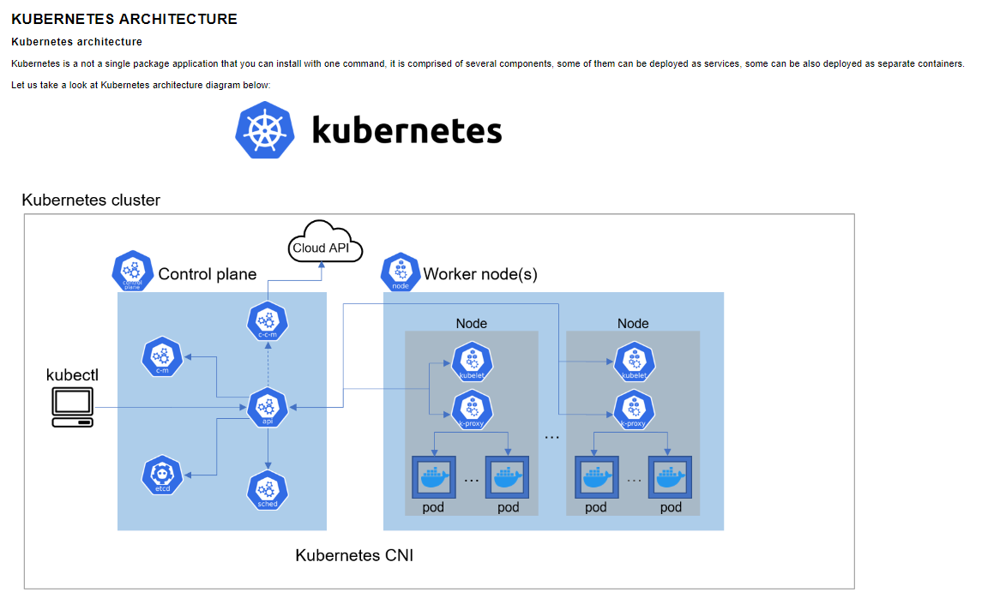

- Make sure you understand the role of each component on the diagram above, without this understanding it will be extremely difficult for you to install and operate a K8s cluster, especially when it comes to troubleshooting and maintenance.

## Kubernetes From-Ground-Up
### K8s installation options

- For a better understanding of each aspect of spinning up a Kubernetes cluster, we will do it without any automated helpers. You will install each and every component manually from scratch and learn how to make them work together – we call this approach "K8s From-Ground-Up".

- To successfully implement "K8s From-Ground-Up", the following and even more will be done by you as a K8s administrator:

1. Install and configure master (also known as control plane) components and worker nodes (or just nodes).
2. Apply security settings across the entire cluster (i.e., encrypting the data in transit, and at rest)
   - In transit encryption means encrypting communications over the network using HTTPS
   - At rest encryption means encrypting the data stored on a disk
3. Plan the capacity for the backend data store etcd
4. Configure network plugins for the containers to communicate
5. Manage periodical upgrade of the cluster
6. Configure observability and auditing

   
### Tools to be used 

1. VM: AWS EC2
2. OS: Ubuntu 16.04 lts+
3. Docker Engine
4. kubectl console utility
5. cfssl and cfssljson utilities
6. Kubernetes cluster

- You will create 6 EC2 Instances, and in the end, we will have the following parts of the cluster properly configured:

  - Three Kubernetes Master
  - Three Kubernetes Worker Nodes
  - Configured SSL/TLS certificates for Kubernetes components to communicate securely
  - Configured Node Network
  - Configured Pod Network

### STEP 0-INSTALL CLIENT TOOLS BEFORE BOOTSTRAPPING THE CLUSTER.

- First, you will need some client tools installed and configurations made on your client workstation:

1. awscli – is a unified tool to manage your AWS services
2. kubectl – this command line utility will be your main control tool to manage your K8s cluster. You will use this tool so many times, so you will be able to type ‘kubetcl’ on your keyboard with a speed of light. You can always make a shortcut (alias) to just one character ‘k’. Also, add this extremely useful official kubectl Cheat Sheet to your bookmarks, it has examples of the most used ‘kubectl’ commands.
3. cfssl – an open source toolkit for everything TLS/SSL from Cloudflare
4. cfssljson – a program, which takes the JSON output from the cfssl and writes certificates, keys, CSRs, and bundles to disk.

### Install and configure AWS CLI

- Configure AWS CLI to access all AWS services used, for this you need to have a user with programmatic access keys configured in AWS Identity and Access Management (IAM):

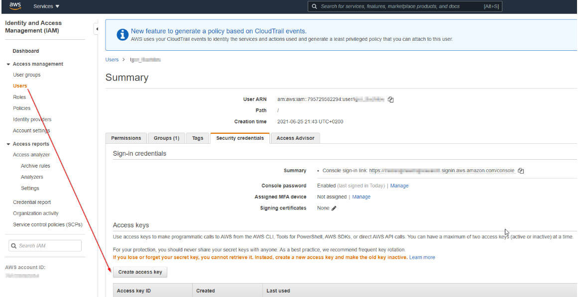

- Generate access keys and store them in a safe place.

- On your local workstation download and install the latest version of AWS CLI

- To configure your AWS CLI – run your shell (or cmd if using Windows) and run

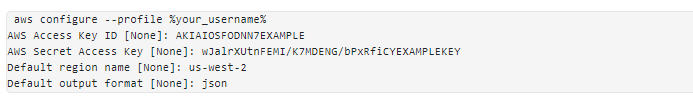

- Test your AWS CLI by running:

         aws ec2 describe-vpcs

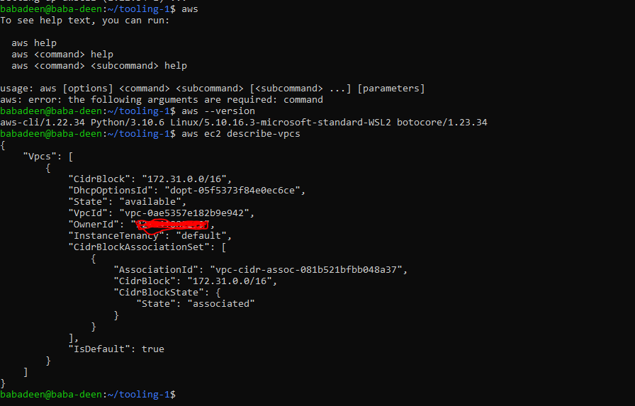

### Install kubectl

- With this tool you can easily interact with Kubernetes to deploy applications, inspect and manage cluster resources, view logs and perform many more administrative operations.

- Installing kubectl on Linux machine

- Linux Or Windows using Gitbash or similar tool

- Download the binary

         wget https://storage.googleapis.com/kubernetes-release/release/v1.21.0/bin/linux/amd64/kubectl 

- Make it executable

         chmod +x kubectl

- Move to the Bin directory

        sudo mv kubectl /usr/local/bin/

- Verify that kubectl version 1.21.0 or higher is installed:

         kubectl version --client

Output:

            babadeen@baba-deen:~/k8s-cluster-from-ground-up/ca-authority$ kubectl  version --client
            Client Version: version.Info{Major:"1", Minor:"21", GitVersion:"v1.21.0", GitCommit:"cb303e613a121a29364f75cc67d3d580833a7479", GitTreeState:"clean", BuildDate:"2021-04-08T16:31:21Z", GoVersion:"go1.16.1", Compiler:"gc", Platform:"linux/amd64"}

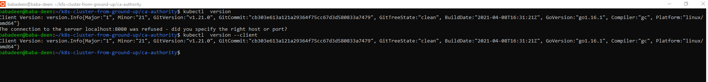
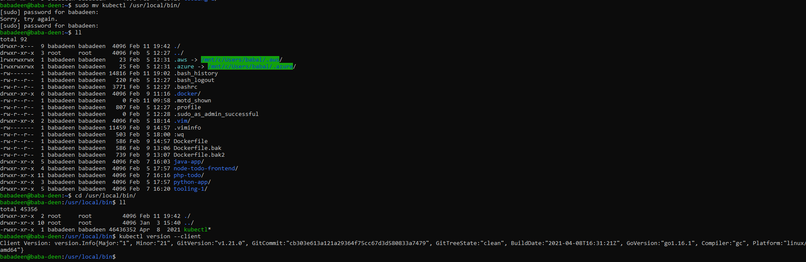

### Install CFSSL and CFSSLJSON

- cfssl is an open source tool by Cloudflare used to setup a Public Key Infrastructure (PKI Infrastructure) for generating, signing and bundling TLS certificates. In previous projects you have experienced the use of Letsencrypt for the similar use case. Here, cfssl will be configured as a Certificate Authority which will issue the certificates required to spin up a Kubernetes cluster.

- Download, install and verify successful installation of cfssl and cfssljson:

- Install CFSSL and CFSSLJSON-linux

            wget -q --show-progress --https-only --timestamping \
            https://storage.googleapis.com/kubernetes-the-hard-way/cfssl/1.4.1/linux/cfssl \
            https://storage.googleapis.com/kubernetes-the-hard-way/cfssl/1.4.1/linux/cfssljson

        chmod +x cfssl cfssljson
        sudo mv cfssl cfssljson /usr/local/bin/

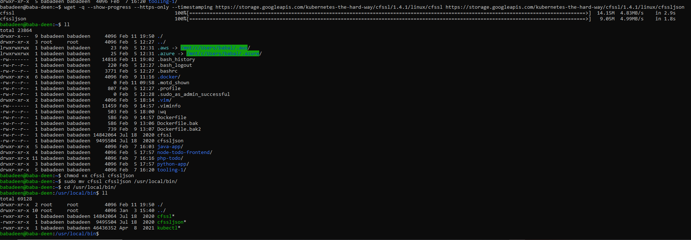

### AWS CLOUD RESOURCES FOR KUBERNETES CLUSTER

- As we already know, we need some machines to run the control plane and the worker nodes. In this section, you will provision EC2 Instances required to run your K8s cluster. You can use Terraform for this. But it is highly recommended to start out first with manual provisioning using awscli and have thorough knowledge about the whole setup. After that, you can destroy the entire project and start all over again using Terraform. This manual approach will solidify your skills and give you the opportunity to face more challenges.

### Step 1 – Configure Network Infrastructure Virtual Private Cloud – VPC

- Create a directory named `k8s-cluster-from-ground-up`

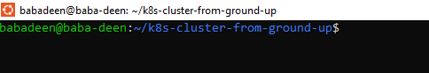

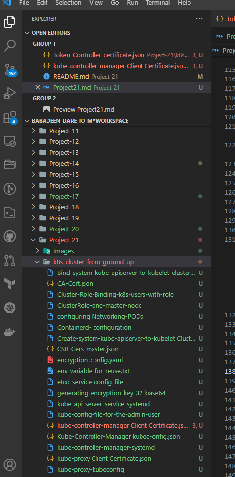

- Create a VPC and store the ID as a variable:

      VPC_ID=$(aws ec2 create-vpc \
      --cidr-block 172.31.0.0/16 \
      --output text --query 'Vpc.VpcId'
      )

- Tag the VPC so that it is named:

      NAME=k8s-cluster-from-ground-up

      aws ec2 create-tags \
        --resources ${VPC_ID} \
        --tags Key=Name,Value=${NAME}

 - Enable - Domain Name System DNS to support for your VPC and Enable DNS support for hostnames:

        aws ec2 modify-vpc-attribute \
        --vpc-id ${VPC_ID} \
        --enable-dns-support '{"Value": true}'

          aws ec2 modify-vpc-attribute \
          --vpc-id ${VPC_ID} \
          --enable-dns-hostnames '{"Value": true}'

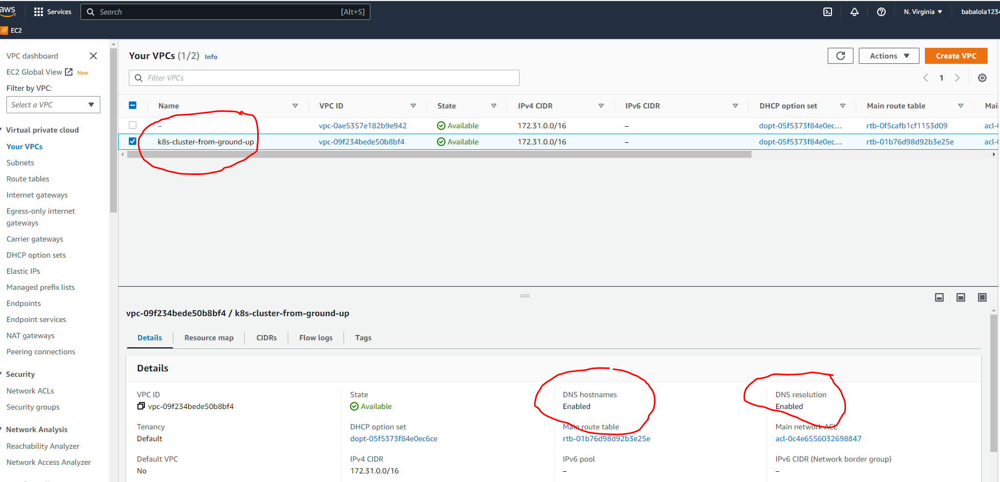

- Set the required AWS Region

        AWS_REGION=us-east-1

- Configure DHCP Options Set:

          DHCP_OPTION_SET_ID=$(aws ec2 create-dhcp-options \
          --dhcp-configuration \
          "Key=domain-name,Values=$AWS_REGION.compute.internal" \
          "Key=domain-name-servers,Values=AmazonProvidedDNS" \
          --output text --query 'DhcpOptions.DhcpOptionsId')

- Tag the DHCP Option set:

          aws ec2 create-tags \
          --resources ${DHCP_OPTION_SET_ID} \
          --tags Key=Name,Value=${NAME}

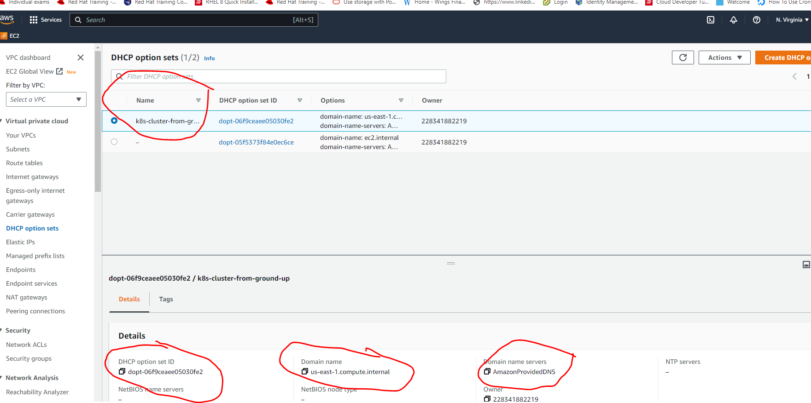

-  Associate the DHCP Option set with the VPC:

          aws ec2 associate-dhcp-options \
          --dhcp-options-id ${DHCP_OPTION_SET_ID} \
          --vpc-id ${VPC_ID}

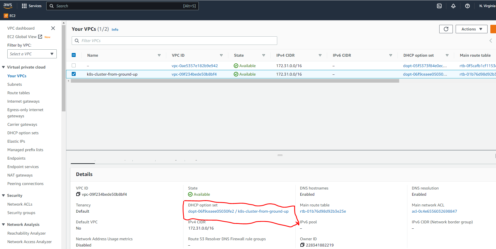

- Create the Subnet

        SUBNET_ID=$(aws ec2 create-subnet \
        --vpc-id ${VPC_ID} \
        --cidr-block 172.31.0.0/24 \
        --output text --query 'Subnet.SubnetId')

        aws ec2 create-tags \
        --resources ${SUBNET_ID} \
        --tags Key=Name,Value=${NAME}

-  Create the Internet Gateway and attach it to the VPC:

        INTERNET_GATEWAY_ID=$(aws ec2 create-internet-gateway \
          --output text --query 'InternetGateway.InternetGatewayId')
        aws ec2 create-tags \
          --resources ${INTERNET_GATEWAY_ID} \
          --tags Key=Name,Value=${NAME}

        aws ec2 attach-internet-gateway \
          --internet-gateway-id ${INTERNET_GATEWAY_ID} \
          --vpc-id ${VPC_ID}

-  Create route tables, associate the route table to subnet, and create a route to allow external traffic to the Internet through the Internet Gateway:

        ROUTE_TABLE_ID=$(aws ec2 create-route-table \
          --vpc-id ${VPC_ID} \
          --output text --query 'RouteTable.RouteTableId')
        aws ec2 create-tags \
          --resources ${ROUTE_TABLE_ID} \
          --tags Key=Name,Value=${NAME}
        aws ec2 associate-route-table \
          --route-table-id ${ROUTE_TABLE_ID} \
          --subnet-id ${SUBNET_ID}
        aws ec2 create-route \
          --route-table-id ${ROUTE_TABLE_ID} \
          --destination-cidr-block 0.0.0.0/0 \
          --gateway-id ${INTERNET_GATEWAY_ID}

###  Configure security groups

- Create the security group and store its ID in a variable

        SECURITY_GROUP_ID=$(aws ec2 create-security-group \
        --group-name ${NAME} \
        --description "Kubernetes cluster security group" \
        --vpc-id ${VPC_ID} \
        --output text --query 'GroupId')

- Create the NAME tag for the security group

      aws ec2 create-tags \
      --resources ${SECURITY_GROUP_ID} \
      --tags Key=Name,Value=${NAME}

- Create Inbound traffic for all communication within the subnet to connect on ports used by the master node(s)

        aws ec2 authorize-security-group-ingress \
        --group-id ${SECURITY_GROUP_ID} \
        --ip-permissions IpProtocol=tcp,FromPort=2379,ToPort=2380,IpRanges='[{CidrIp=172.31.0.0/24}]'

- Create Inbound traffic for all communication within the subnet to connect on ports used by the worker nodes

          aws ec2 authorize-security-group-ingress \
          --group-id ${SECURITY_GROUP_ID} \
          --ip-permissions IpProtocol=tcp,FromPort=30000,ToPort=32767,IpRanges='[{CidrIp=172.31.0.0/24}]'

-  Create inbound traffic to allow connections to the Kubernetes API Server listening on port 6443

          aws ec2 authorize-security-group-ingress \
          --group-id ${SECURITY_GROUP_ID} \
          --protocol tcp \
          --port 6443 \
          --cidr 0.0.0.0/0

-  Create Inbound traffic for SSH from anywhere (Do not do this in production. Limit access ONLY to IPs or CIDR that MUST connect)

            aws ec2 authorize-security-group-ingress \
          --group-id ${SECURITY_GROUP_ID} \
          --protocol tcp \
          --port 22 \
          --cidr 0.0.0.0/0

- Create ICMP ingress for all types

        aws ec2 authorize-security-group-ingress \
        --group-id ${SECURITY_GROUP_ID} \
        --protocol icmp \
        --port -1 \
        --cidr 0.0.0.0/0

-  Create a network Load balancer:

        LOAD_BALANCER_ARN=$(aws elbv2 create-load-balancer \
        --name ${NAME} \
        --subnets ${SUBNET_ID} \
        --scheme internet-facing \
        --type network \
        --output text --query 'LoadBalancers[].LoadBalancerArn')

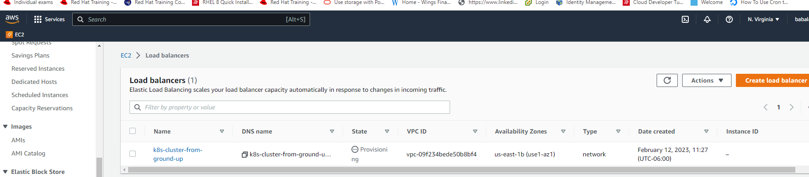

-  Create a target group: (For now it will be unhealthy because there are no real targets yet.)

        TARGET_GROUP_ARN=$(aws elbv2 create-target-group \
          --name ${NAME} \
          --protocol TCP \
          --port 6443 \
          --vpc-id ${VPC_ID} \
          --target-type ip \
          --output text --query 'TargetGroups[].TargetGroupArn')

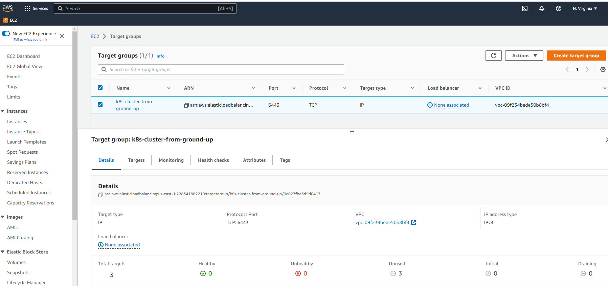

- Register targets: (Just like above, no real targets. You will just put the IP addresses so that, when the nodes become available, they will be used as targets.)

        aws elbv2 register-targets \
        --target-group-arn ${TARGET_GROUP_ARN} \
        --targets Id=172.31.0.1{0,1,2}

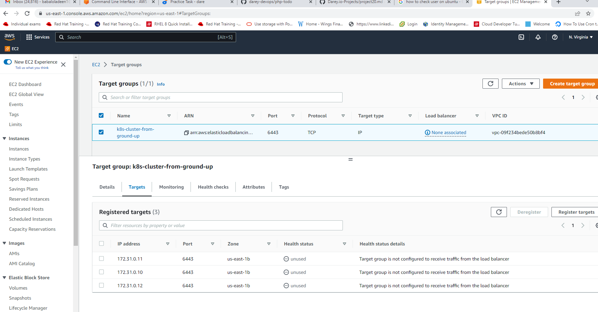

- Create a listener to listen for requests and forward to the target nodes on TCP port 6443

      aws elbv2 create-listener \
      --load-balancer-arn ${LOAD_BALANCER_ARN} \
      --protocol TCP \
      --port 6443 \
      --default-actions Type=forward,TargetGroupArn=${TARGET_GROUP_ARN} \
      --output text --query 'Listeners[].ListenerArn'

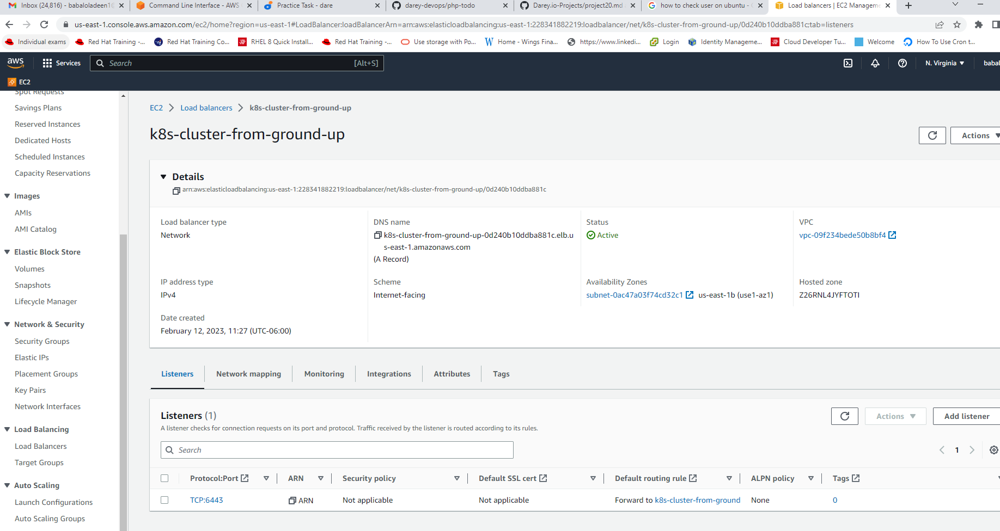

- Get the Kubernetes Public address

      KUBERNETES_PUBLIC_ADDRESS=$(aws elbv2 describe-load-balancers \
      --load-balancer-arns ${LOAD_BALANCER_ARN} \
      --output text --query 'LoadBalancers[].DNSName')

### STEP 2 – CREATE COMPUTE RESOURCES

-  Get an image to create EC2 instances --AMIs

          IMAGE_ID=$(aws ec2 describe-images --owners 099720109477 \
          --filters \
          'Name=root-device-type,Values=ebs' \
          'Name=architecture,Values=x86_64' \
          'Name=name,Values=amazon/ubuntu/images/hvm-ssd/ubuntu-focal-16.04-amd64-server-20210415' \
          | jq -r '.Images|sort_by(.Name)[-1]|.ImageId')

- Create SSH Key-Pair

      mkdir -p ssh

      aws ec2 create-key-pair \
      --key-name ${NAME} \
      --output text --query 'KeyMaterial' \
      > ssh/${NAME}.id_rsa

      chmod 600 ssh/${NAME}.id_rsa

### Create EC2 Instances for Controle Plane (Master Nodes)

-  Create 3 Master nodes: Note – Using t2.micro instead of t2.small as t2.micro is covered by AWS free tier

        for i in 0 1 2; do
          instance_id=$(aws ec2 run-instances \
            --associate-public-ip-address \
            --image-id ${IMAGE_ID} \
            --count 1 \
            --key-name ${NAME} \
            --security-group-ids ${SECURITY_GROUP_ID} \
            --instance-type t2.micro \
            --private-ip-address 172.31.0.1${i} \
            --user-data "name=master-${i}" \
            --subnet-id ${SUBNET_ID} \
            --output text --query 'Instances[].InstanceId')
          aws ec2 modify-instance-attribute \
            --instance-id ${instance_id} \
            --no-source-dest-check
          aws ec2 create-tags \
            --resources ${instance_id} \
            --tags "Key=Name,Value=${NAME}-master-${i}"
        done

### EC2 Instances for Worker Nodes

- Create 3 worker nodes

      for i in 0 1 2; do
        instance_id=$(aws ec2 run-instances \
          --associate-public-ip-address \
          --image-id ${IMAGE_ID} \
          --count 1 \
          --key-name ${NAME} \
          --security-group-ids ${SECURITY_GROUP_ID} \
          --instance-type t2.micro \
          --private-ip-address 172.31.0.2${i} \
          --user-data "name=worker-${i}|pod-cidr=172.20.${i}.0/24" \
          --subnet-id ${SUBNET_ID} \
          --output text --query 'Instances[].InstanceId')
        aws ec2 modify-instance-attribute \
          --instance-id ${instance_id} \
          --no-source-dest-check
        aws ec2 create-tags \
          --resources ${instance_id} \
          --tags "Key=Name,Value=${NAME}-worker-${i}"
        done

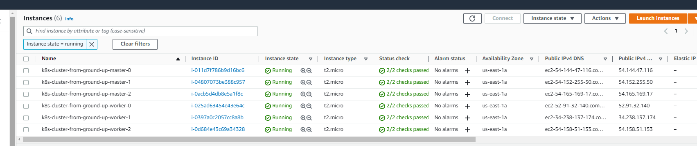

### Step 3 Prepare The Self-Signed Certificate Authority And Generate TLS Certificates
### The following components running on the Master node will require TLS certificates

* kube-controller-manager
* kube-scheduler
* etcd
* kube-apiserver

### The following components running on the Worker nodes will require TLS certificates

* kubelet
* kube-proxy

- Therefore, you will provision a PKI Infrastructure using `cfssl` which will have a Certificate Authority. The CA will then generate certificates for all the individual components.

### Self-Signed Root Certificate Authority (CA)

- Create a directory called ` ca-authority` and `cd ` into it

      mkdir ca-authority && cd ca-authority

- Generate the CA configuration file, Root Certificate, and Private key:

          {

          cat > ca-config.json <<EOF
          {
      "signing": {
          "default": {
          "expiry": "8760h"
          },
          "profiles": {
            "kubernetes": {
              "usages": ["signing", "key encipherment", "server auth", "client auth"],
              "expiry": "8760h"
            }
          }
      }
      }
      EOF

      cat > ca-csr.json <<EOF
      {
      "CN": "Kubernetes",
      "key": {
        "algo": "rsa",
        "size": 2048
      },
      "names": [
      {
        "C": "US",
        "L": "St Francis",
        "O": "Kubernetes",
        "OU": "BABA-Deen DEVOPS",
        "ST": "Minnesota"
          }
      ]
      }
      EOF

      cfssl gencert -initca ca-csr.json | cfssljson -bare ca

      }

- The file defines the following:

    * CN – Common name for the authority
    
    * algo – the algorithm used for the certificates
    
    * size – algorithm size in bits
    
    * C – Country
    
    * L – Locality (city)
    
    * ST – State or province
    
    * O – Organization
    
    * OU – Organizational Unit

- Output of CA generated 

      2021/05/16 20:18:44 [INFO] generating a new CA key and certificate from CSR
      2021/05/16 20:18:44 [INFO] generate received request
      2021/05/16 20:18:44 [INFO] received CSR
      2021/05/16 20:18:44 [INFO] generating key: rsa-2048
      2021/05/16 20:18:44 [INFO] encoded CSR
      2021/05/16 20:18:44 [INFO] signed certificate with serial number 478642753175858256977534824638605235819766817855

- List the directory to see the created files

      -rw-r--r-- 1 babadeen babadeen  234 Feb 21 19:43 ca-csr.json
      -rw-r--r-- 1 babadeen babadeen  232 Feb 21 19:43 ca-config.json
      -rw-r--r-- 1 babadeen babadeen 1379 Feb 21 19:43 ca.pem
      -rw-r--r-- 1 babadeen babadeen 1037 Feb 21 19:43 ca.csr
      -rw------- 1 babadeen babadeen 1679 Feb 21 19:43 ca-key.pem

- The 3 important files here are:

    * ca.pem – The Root Certificate
    * ca-key.pem – The Private Key
    * ca.csr – The Certificate Signing Request

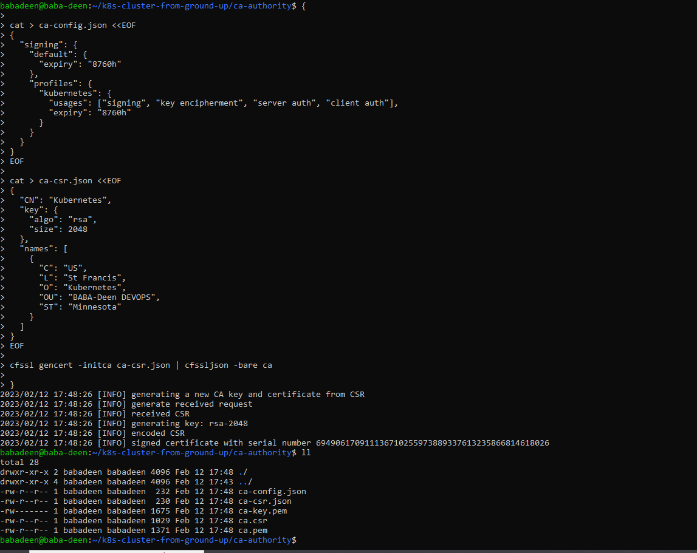
# Generating TLS Certificates For Client and Server

- You will need to provision Client/Server certificates for all the components. It is a MUST to have encrypted communication within the cluster. Therefore, the server here are the master nodes running the api-server component. While the client is every other component that needs to communicate with the api-server.

- Now we have a certificate for the Root CA, we can then begin to request more certificates which the different Kubernetes components, i.e. clients and server, will use to have encrypted communication.

- Remember, the clients here refer to every other component that will communicate with the api-server. These are:

    * kube-controller-manager
    * kube-scheduler
    * etcd
    * kubelet
    * kube-proxy
    * Kubernetes Admin User

# Let us begin with the Kubernetes API-Server Certificate and Private Key

- The certificate for the Api-server must have IP addresses, DNS names, and a Load Balancer address included. Otherwise, you will have a lot of difficulties connecting to the api-server.

-  Generate the Certificate Signing Request (CSR), Private Key and the Certificate for the Kubernetes Master Nodes

        {
        cat > master-kubernetes-csr.json <<EOF
        {
        "CN": "kubernetes",
          "hosts": [
          "127.0.0.1",
          "172.31.0.10",
          "172.31.0.11",
          "172.31.0.12",
          "ip-172-31-0-10",
          "ip-172-31-0-11",
        "ip-172-31-0-12",
        "ip-172-31-0-10.${AWS_REGION}.compute.internal",
        "ip-172-31-0-11.${AWS_REGION}.compute.internal",
        "ip-172-31-0-12.${AWS_REGION}.compute.internal",
        "${KUBERNETES_PUBLIC_ADDRESS}",
        "kubernetes",
        "kubernetes.default",
        "kubernetes.default.svc",
        "kubernetes.default.svc.cluster",
        "kubernetes.default.svc.cluster.local"
        ],
        "key": {
          "algo": "rsa",
          "size": 2048
        },
        "names": [
          {
            "C": "US",
              "L": "St Francis",
              "O": "Kubernetes",
                  "OU": "BABA-Deen DEVOPS",
              "ST": "Minnesota"
          }
        ]
        }
        EOF

        cfssl gencert \
            -ca=ca.pem \
        -ca-key=ca-key.pem \
        -config=ca-config.json \
          -profile=kubernetes \
          master-kubernetes-csr.json | cfssljson -bare master-kubernetes
        }  

#  Creating the other certificates: for the following Kubernetes components:

1. kube-Scheduler Client Certificate and Private Key
2. Kube-Proxy Client Certificate
3. kube-Controller Manager Client Certificate
4. kubelet Client Certificate and Private Key
5. K8s admin user Client Certificate
6. kube-scheduler Client Certificate and Private Key
7. Token Controller certs 

- kube-scheduler Client Certificate and Private Key

      {

      cat > kube-scheduler-csr.json <<EOF
      {
        "CN": "system:kube-scheduler",
        "key": {
          "algo": "rsa",
          "size": 2048
        },
        "names": [
          {
            "C": "US",
            "L": "St Francis",
            "O": "system:kube-scheduler",
            "OU": "BABA-Deen DEVOPS",
            "ST": "Minnesota"
          }
        ]
      }
      EOF
      
      cfssl gencert \
        -ca=ca.pem \
        -ca-key=ca-key.pem \
        -config=ca-config.json \
        -profile=kubernetes \
        kube-scheduler-csr.json | cfssljson -bare kube-scheduler
       }
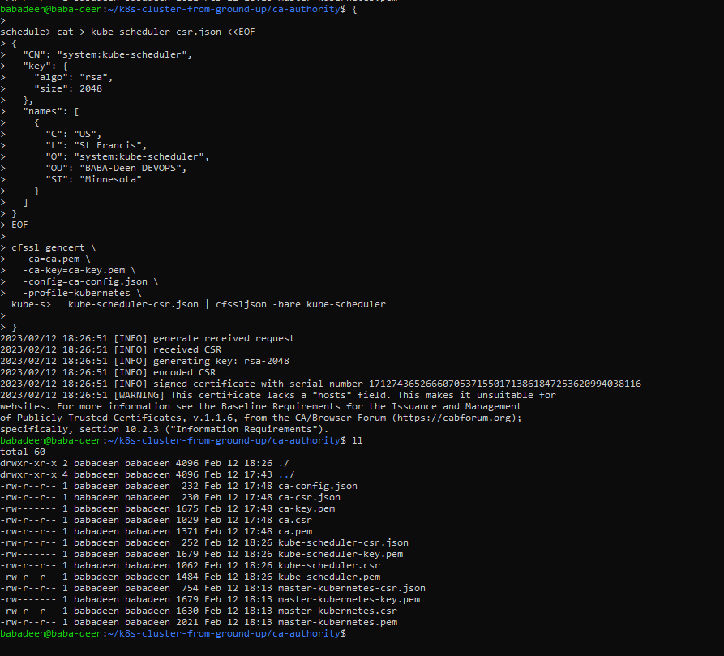

- kube-proxy Client Certificate and Private Key

      {

        cat > kube-proxy-csr.json <<EOF
        {
          "CN": "system:kube-proxy",
          "key": {
            "algo": "rsa",
            "size": 2048
          },
          "names": [
            {
              "C": "US",
              "L": "St Francis",
              "O": "system:node-proxier",
              "OU": "BABA-Deen DEVOPS",
              "ST": "Minnesota"
            }
          ]
        }
        EOF
        
        cfssl gencert \
          -ca=ca.pem \
          -ca-key=ca-key.pem \
          -config=ca-config.json \
          -profile=kubernetes \
          kube-proxy-csr.json | cfssljson -bare kube-proxy
        
        }
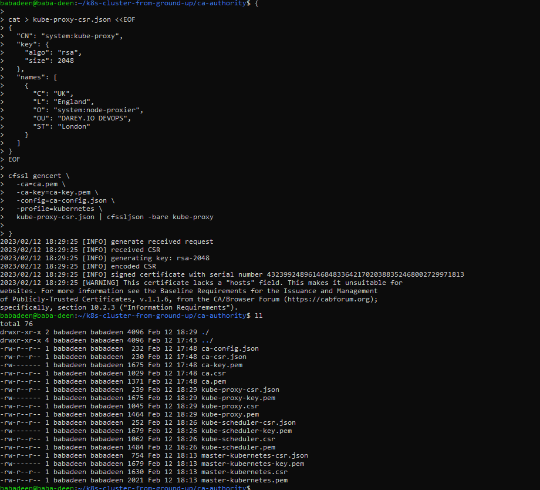

- kube-controller-manager Client Certificate

      {
      cat > kube-controller-manager-csr.json <<EOF
      {
        "CN": "system:kube-controller-manager",
        "key": {
          "algo": "rsa",
          "size": 2048
        },
        "names": [
          {
            "C": "US",
            "L": "St Francis",
            "O": "system:kube-controller-manager",
            "OU": "BABA-Deen DEVOPS",
            "ST": "Minnesota"
          }
        ]
      }
      EOF
      
      cfssl gencert \
        -ca=ca.pem \
        -ca-key=ca-key.pem \
        -config=ca-config.json \
        -profile=kubernetes \
        kube-controller-manager-csr.json | cfssljson -bare kube-controller-manager
      
      }
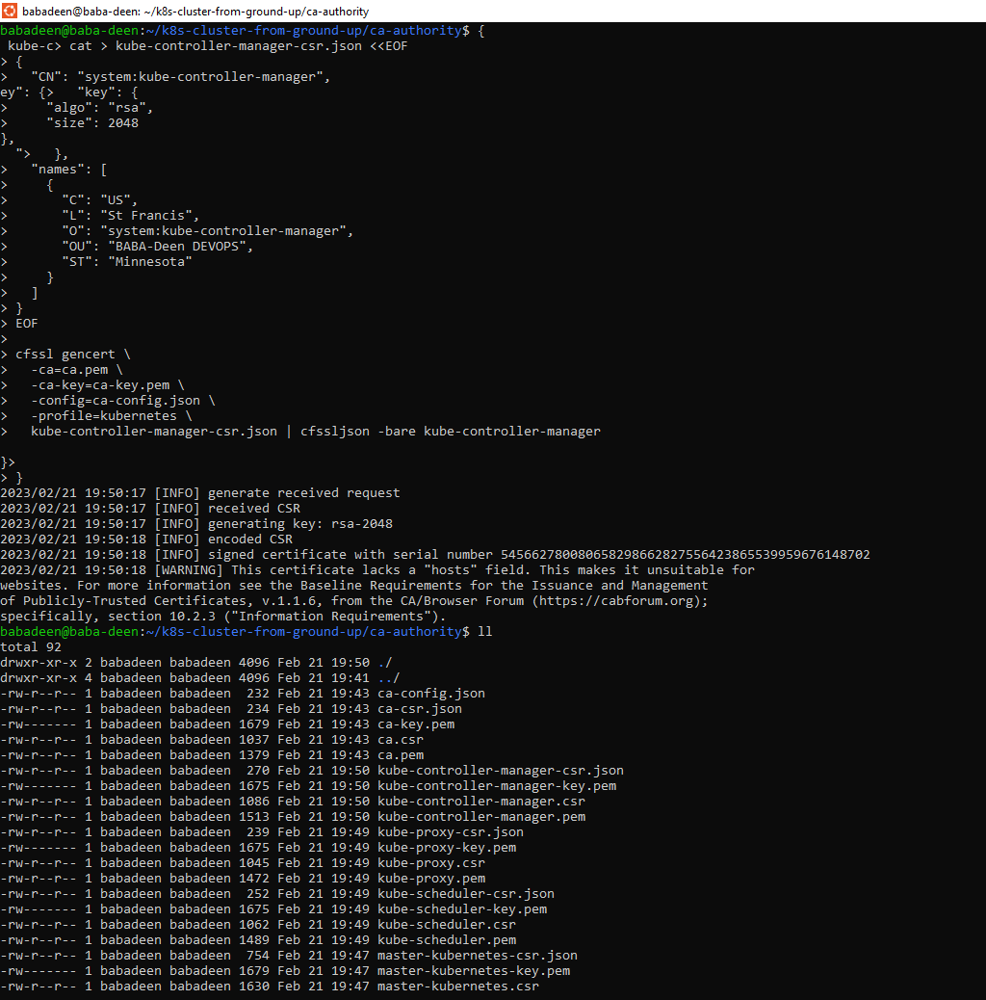

- Token Controller certs -- used by pods or other resources to establish connectivity to the api-server

        {

        cat > service-account-csr.json <<EOF
        {
          "CN": "service-accounts",
          "key": {
            "algo": "rsa",
            "size": 2048
          },
          "names": [
            {
              "C": "US",
              "L": "St Francis",
              "O": "Kubernetes",
              "OU": "BABA-Deen DEVOPS",
              "ST": "Minnesota"
            }
          ]
        }
        EOF
        
        cfssl gencert \
          -ca=ca.pem \
          -ca-key=ca-key.pem \
          -config=ca-config.json \
          -profile=kubernetes \
          service-account-csr.json | cfssljson -bare service-account
        }

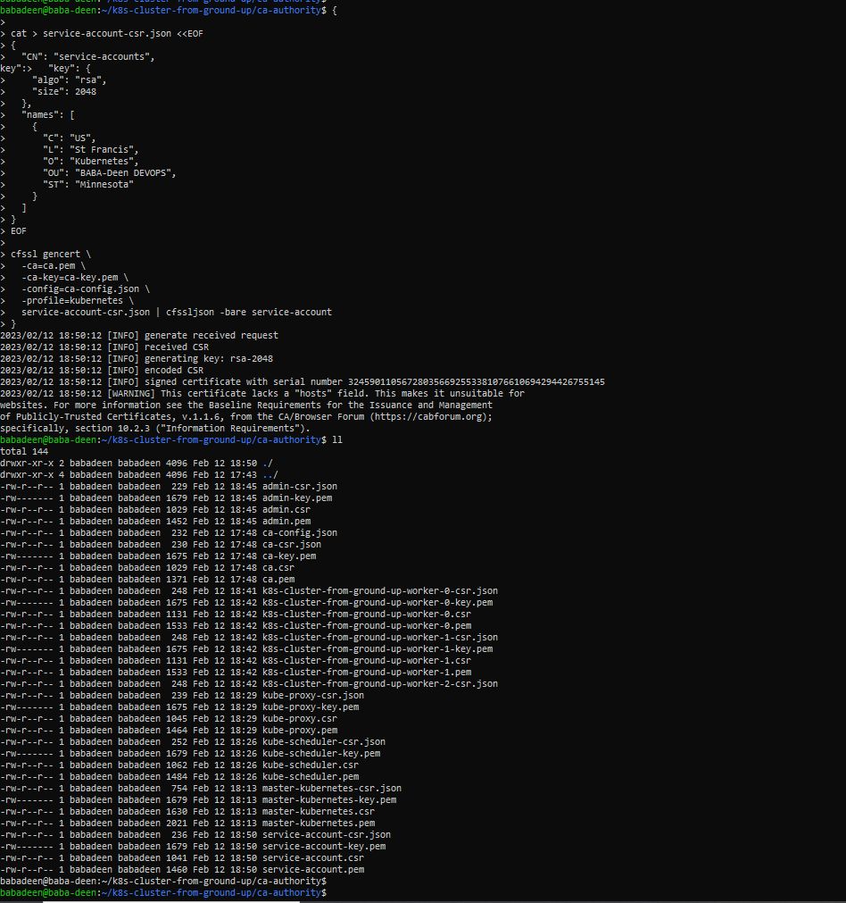

### Similar to how you configured the api-server's certificate, Kubernetes requires that the hostname of each worker node is included in the client certificate.

Also, Kubernetes uses a special-purpose authorization mode called Node Authorizer, that specifically authorizes API requests made by kubelet services. In order to be authorized by the Node Authorizer, kubelets must use a credential that identifies them as being in the system:nodes group, with a username of system:node:<nodeName>. Notice the "CN": "system:node:${instance_hostname}", in the below code.

Therefore, the certificate to be created must comply to these requirements. In the below example, there are 3 worker nodes, hence we will use bash to loop through a list of the worker nodes’ hostnames, and based on each index, the respective Certificate Signing Request (CSR), private key and client certificates will be generated.

- kubelet Client Certificate and Private Key

      for i in 0 1 2; do
        instance="${NAME}-worker-${i}"
        instance_hostname="ip-172-31-0-2${i}"
        cat > ${instance}-csr.json <<EOF
      {
        "CN": "system:node:${instance_hostname}",
        "key": {
          "algo": "rsa",
          "size": 2048
        },
        "names": [
          {
            "C": "US",
            "L": "St Francis",
            "O": "system:nodes",
            "OU": "BABA-Deen DEVOPS",
            "ST": "Minnesota"
          }
        ]
      }
      EOF

        external_ip=$(aws ec2 describe-instances \
          --filters "Name=tag:Name,Values=${instance}" \
          --output text --query 'Reservations[].Instances[].PublicIpAddress')

        internal_ip=$(aws ec2 describe-instances \
          --filters "Name=tag:Name,Values=${instance}" \
          --output text --query 'Reservations[].Instances[].PrivateIpAddress')

        cfssl gencert \
          -ca=ca.pem \
          -ca-key=ca-key.pem \
          -config=ca-config.json \
          -hostname=${instance_hostname},${external_ip},${internal_ip} \
          -profile=kubernetes \
          ${NAME}-worker-${i}-csr.json | cfssljson -bare ${NAME}-worker-${i}
      done

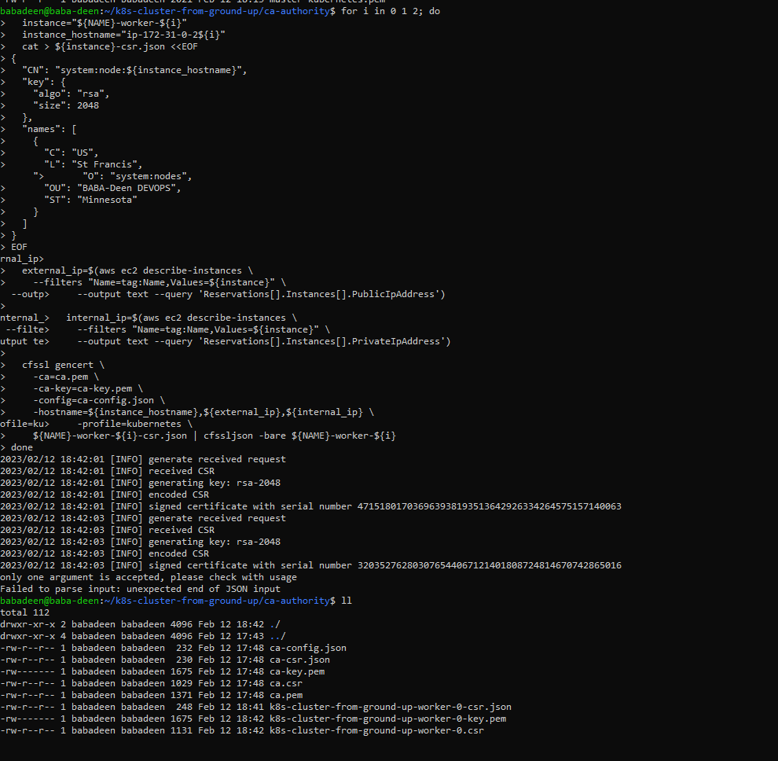

- kubernetes admin user's Client Certificate

      {
        cat > admin-csr.json <<EOF
        {
          "CN": "admin",
          "key": {
            "algo": "rsa",
            "size": 2048
          },
          "names": [
            {
              "C": "US",
              "L": "St Francis",
              "O": "system:masters",
              "OU": "BABA-Deen DEVOPS",
              "ST": "Minnesota"
            }
          ]
        }
        EOF
        
        cfssl gencert \
          -ca=ca.pem \
          -ca-key=ca-key.pem \
          -config=ca-config.json \
          -profile=kubernetes \
          admin-csr.json | cfssljson -bare admin
        }

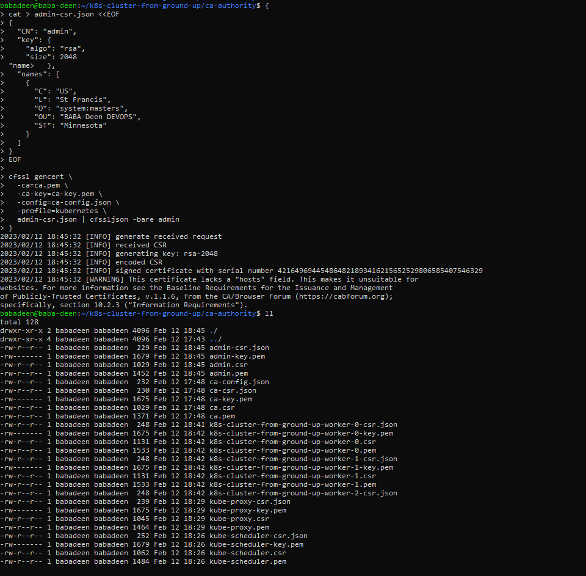

### STEP 4 – DISTRIBUTING THE CLIENT AND SERVER CERTIFICATES
### Now it is time to start sending all the client and server certificates to their respective instances.

- Let us begin with the worker nodes:

- Copy these files securely to the master and worker nodes using `scp` utility

    *  Root CA certificate – ca.pem
    * X509 Certificate for each worker node
    *  Private Key of the certificate for each worker node

- Worker nodes: scp push

      for i in 0 1 2; do
        instance="${NAME}-worker-${i}"
        external_ip=$(aws ec2 describe-instances \
          --filters "Name=tag:Name,Values=${instance}" \
          --output text --query 'Reservations[].Instances[].PublicIpAddress')
        scp -i ../ssh/${NAME}.id_rsa \
          ca.pem ${instance}-key.pem ${instance}.pem ubuntu@${external_ip}:~/; \
      done

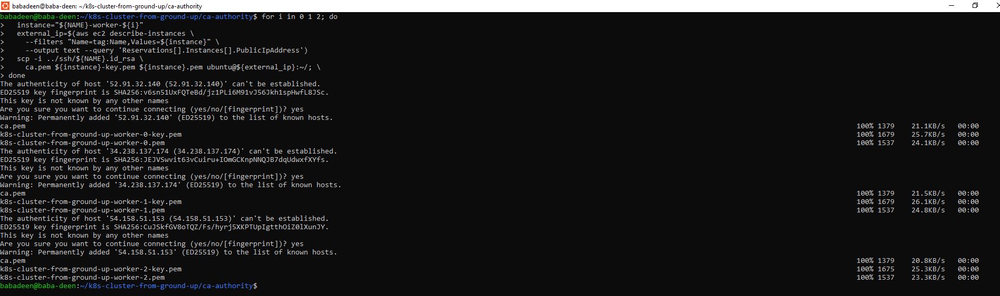

- Master or Controller node: scp push 
- Note that only the api-server related files will be sent over to the master nodes.

      for i in 0 1 2; do
      instance="${NAME}-master-${i}" \
        external_ip=$(aws ec2 describe-instances \
          --filters "Name=tag:Name,Values=${instance}" \
          --output text --query 'Reservations[].Instances[].PublicIpAddress')
        scp -i ../ssh/${NAME}.id_rsa \
          ca.pem ca-key.pem service-account-key.pem service-account.pem \
          master-kubernetes.pem master-kubernetes-key.pem ubuntu@${external_ip}:~/;
      done

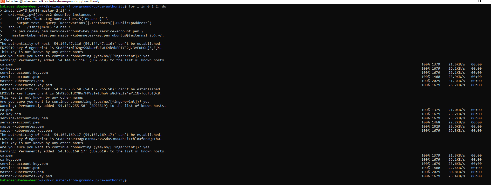

###  The kube-proxy, kube-controller-manager, kube-scheduler, and kubelet client certificates will be used to generate client authentication configuration files later.

### STEP 5 USE `KUBECTL` TO GENERATE KUBERNETES CONFIGURATION FILES FOR AUTHENTICATION

- First, let us create a few environment variables for reuse by multiple commands.

      KUBERNETES_API_SERVER_ADDRESS=$(aws elbv2 describe-load-balancers --load-balancer-arns ${LOAD_BALANCER_ARN} --output text --query 'LoadBalancers[].DNSName')

### For each of the nodes running the kubelet component, it is very important that the client certificate configured for that node is used to generate the kubeconfig. This is because each certificate has the node’s DNS name or IP Address configured at the time the certificate was generated. It will also ensure that the appropriate authorization is applied to that node through the Node Authorizer

1. Generate the kubelet kubeconfig file
2. Generate the kube-proxy kubeconfig
3. Generate the Kube-Controller-Manager kubeconfig
4. Generating the Kube-Scheduler Kubeconfig
5. generate the kubeconfig file for the admin user

- Generate the `kubelet kubeconfig file`

    *  Below command must be run in the directory where all the certificates were generated.

      for i in 0 1 2; do

      instance="${NAME}-worker-${i}"
      instance_hostname="ip-172-31-0-2${i}"

      # Set the kubernetes cluster in the kubeconfig file
        kubectl config set-cluster ${NAME} \
          --certificate-authority=ca.pem \
          --embed-certs=true \
          --server=https://$KUBERNETES_API_SERVER_ADDRESS:6443 \
          --kubeconfig=${instance}.kubeconfig

      # Set the cluster credentials in the kubeconfig file
        kubectl config set-credentials system:node:${instance_hostname} \
          --client-certificate=${instance}.pem \
          --client-key=${instance}-key.pem \
          --embed-certs=true \
          --kubeconfig=${instance}.kubeconfig

      # Set the context in the kubeconfig file
        kubectl config set-context default \
          --cluster=${NAME} \
          --user=system:node:${instance_hostname} \
          --kubeconfig=${instance}.kubeconfig

        kubectl config use-context default --kubeconfig=${instance}.kubeconfig
      done

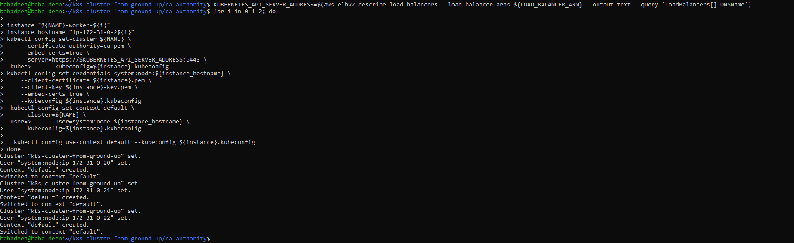

- List the output

       ls -ltr *.kubeconfig

      babadeen@baba-deen:~/k8s-cluster-from-ground-up/ca-authority$ ls -ltr *.kubeconfig
      -rw------- 1 babadeen babadeen 6603 Feb 21 20:15 k8s-cluster-from-ground-up-worker-0.kubeconfig
      -rw------- 1 babadeen babadeen 6603 Feb 21 20:15 k8s-cluster-from-ground-up-worker-1.kubeconfig
      -rw------- 1 babadeen babadeen 6599 Feb 21 20:15 k8s-cluster-from-ground-up-worker-2.kubeconfig
    
      
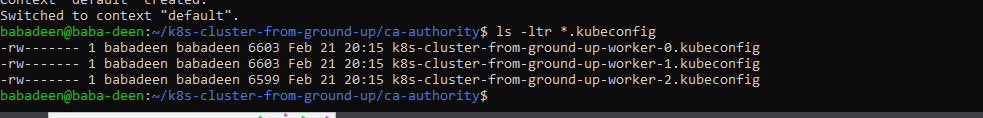

- Generate the `kube-proxy kubeconfig`
    {
      kubectl config set-cluster ${NAME} \
        --certificate-authority=ca.pem \
        --embed-certs=true \
        --server=https://${KUBERNETES_API_SERVER_ADDRESS}:6443 \
        --kubeconfig=kube-proxy.kubeconfig

      kubectl config set-credentials system:kube-proxy \
        --client-certificate=kube-proxy.pem \
        --client-key=kube-proxy-key.pem \
        --embed-certs=true \
        --kubeconfig=kube-proxy.kubeconfig

      kubectl config set-context default \
        --cluster=${NAME} \
        --user=system:kube-proxy \
        --kubeconfig=kube-proxy.kubeconfig

      kubectl config use-context default --kubeconfig=kube-proxy.kubeconfig
      }

- Generate the `Kube-Controller-Manager kubeconfig`

     * Notice that the --server is set to use 127.0.0.1. This is because, this component runs on the API-Server so there is no point routing through the Load Balancer.

      {
        kubectl config set-cluster ${NAME} \
          --certificate-authority=ca.pem \
          --embed-certs=true \
          --server=https://127.0.0.1:6443 \
          --kubeconfig=kube-controller-manager.kubeconfig

        kubectl config set-credentials system:kube-controller-manager \
          --client-certificate=kube-controller-manager.pem \
          --client-key=kube-controller-manager-key.pem \
          --embed-certs=true \
          --kubeconfig=kube-controller-manager.kubeconfig

        kubectl config set-context default \
          --cluster=${NAME} \
          --user=system:kube-controller-manager \
          --kubeconfig=kube-controller-manager.kubeconfig

        kubectl config use-context default --kubeconfig=kube-controller-manager.kubeconfig
      }

- Generating the `Kube-Scheduler Kubeconfig`

    {
      kubectl config set-cluster ${NAME} \
        --certificate-authority=ca.pem \
        --embed-certs=true \
        --server=https://127.0.0.1:6443 \
        --kubeconfig=kube-scheduler.kubeconfig

      kubectl config set-credentials system:kube-scheduler \
        --client-certificate=kube-scheduler.pem \
        --client-key=kube-scheduler-key.pem \
        --embed-certs=true \
        --kubeconfig=kube-scheduler.kubeconfig

      kubectl config set-context default \
        --cluster=${NAME} \
        --user=system:kube-scheduler \
        --kubeconfig=kube-scheduler.kubeconfig

      kubectl config use-context default --kubeconfig=kube-scheduler.kubeconfig
    }

- Finally, generate the `kubeconfig file for the admin user`

      {
        kubectl config set-cluster ${NAME} \
          --certificate-authority=ca.pem \
          --embed-certs=true \
          --server=https://${KUBERNETES_API_SERVER_ADDRESS}:6443 \
          --kubeconfig=admin.kubeconfig

        kubectl config set-credentials admin \
          --client-certificate=admin.pem \
          --client-key=admin-key.pem \
          --embed-certs=true \
          --kubeconfig=admin.kubeconfig

        kubectl config set-context default \
          --cluster=${NAME} \
          --user=admin \
          --kubeconfig=admin.kubeconfig

        kubectl config use-context default --kubeconfig=admin.kubeconfig
      }

### TASK: Distribute the files to their respective servers, using scp and a for loop like we have done previously. This is a test to validate that you understand which component must go to which node.

- Copy these files securely to the master and worker nodes using scp utility

- scp for Master node

1. admin.kubeconfig 
2. kube-scheduler.kubeconfig 
3. kube-controller-manager.kubeconfig

        for i in 0 1 2; do
        instance="${NAME}-master-${i}" \
          external_ip=$(aws ec2 describe-instances \
            --filters "Name=tag:Name,Values=${instance}" \
            --output text --query 'Reservations[].Instances[].PublicIpAddress')
          scp -i ../ssh/${NAME}.id_rsa \
            admin.kubeconfig kube-scheduler.kubeconfig kube-controller-manager.kubeconfig ubuntu@${external_ip}:~/;
        done

- scp for Worker nodes 

      for i in 0 1 2; do
        instance="${NAME}-worker-${i}"
        external_ip=$(aws ec2 describe-instances \
          --filters "Name=tag:Name,Values=${instance}" \
          --output text --query 'Reservations[].Instances[].PublicIpAddress')
        scp -i ../ssh/${NAME}.id_rsa \
          kube-proxy.kubeconfig ${instance}.kubeconfig ubuntu@${external_ip}:~/; \
      done

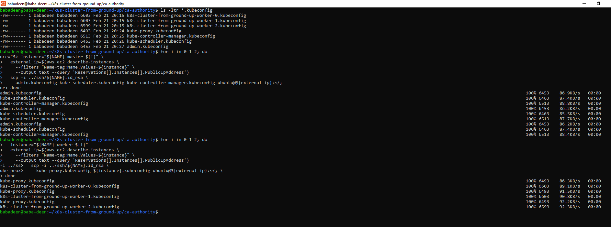

### STEP 6 PREPARE THE ETCD DATABASE FOR ENCRYPTION AT REST.

- Generate the encryption key and encode it using base64

       ETCD_ENCRYPTION_KEY=$(head -c 32 /dev/urandom | base64)

- See the output that will be generated when called. Yours will be a different random string

       echo $ETCD_ENCRYPTION_KEY

- output 

        vYPSB7UY8GLofmGqOEtx2HKt8et/h4OkN1VgFV8IeSspnugBZsw3qGkOWO7wuZFlh8gu5p82Jsan fzORQSc0eA==

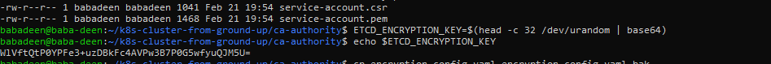

-  Create an encryption-config.yaml file as documented officially by kubernetes

       cat > encryption-config.yaml <<EOF
       kind: EncryptionConfig
       apiVersion: v1
       resources:
        - resources:
           - secrets
          providers:
           - aescbc:
               keys:
                - name: key1
              secret: ${ETCD_ENCRYPTION_KEY}
           - identity: {}
       EOF

- Send the encryption file to the Controller nodes using scp and a for loop

        for i in 0 1 2; do
        instance="${NAME}-master-${i}" \
        external_ip=$(aws ec2 describe-instances \
         --filters "Name=tag:Name,Values=${instance}" \
         --output text --query 'Reservations[].Instances[].PublicIpAddress')
          scp -i ../ssh/${NAME}.id_rsa \
         encryption-config.yaml ubuntu@${external_ip}:~/;
        done

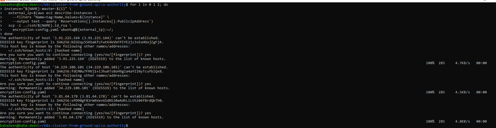

### Bootstrap etcd cluster

- SSH into the controller servers
- TIPS: Use a terminal multi-plexer like multi-tabbed putty or tmux to work with multiple terminal sessions simultaneously. 

1. Master-0
2. Master-1
3. Master-3

- Master-1

      master_1_ip=$(aws ec2 describe-instances \
      --filters "Name=tag:Name,Values=${NAME}-master-0" \
      --output text --query 'Reservations[].Instances[].PublicIpAddress')
      ssh -i k8s-cluster-from-ground-up.id_rsa ubuntu@${master_1_ip}

- Master-2

      master_2_ip=$(aws ec2 describe-instances \
      --filters "Name=tag:Name,Values=${NAME}-master-1" \
      --output text --query 'Reservations[].Instances[].PublicIpAddress')
      ssh -i k8s-cluster-from-ground-up.id_rsa ubuntu@${master_2_ip}

- Master-3

      master_3_ip=$(aws ec2 describe-instances \
      --filters "Name=tag:Name,Values=${NAME}-master-2" \
      --output text --query 'Reservations[].Instances[].PublicIpAddress')
      ssh -i k8s-cluster-from-ground-up.id_rsa ubuntu@${master_3_ip}

- Download and install etcd

        wget -q --show-progress --https-only --timestamping \
        "https://github.com/etcd-io/etcd/releases/download/v3.4.15/etcd-v3.4. 15-linux-amd64.tar.gz"

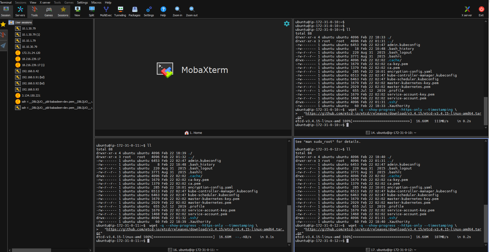

- Extract and install the etcd server and the etcdctl command line utility

       {
        tar -xvf etcd-v3.4.15-linux-amd64.tar.gz
        sudo mv etcd-v3.4.15-linux-amd64/etcd* /usr/local/bin/
       }   

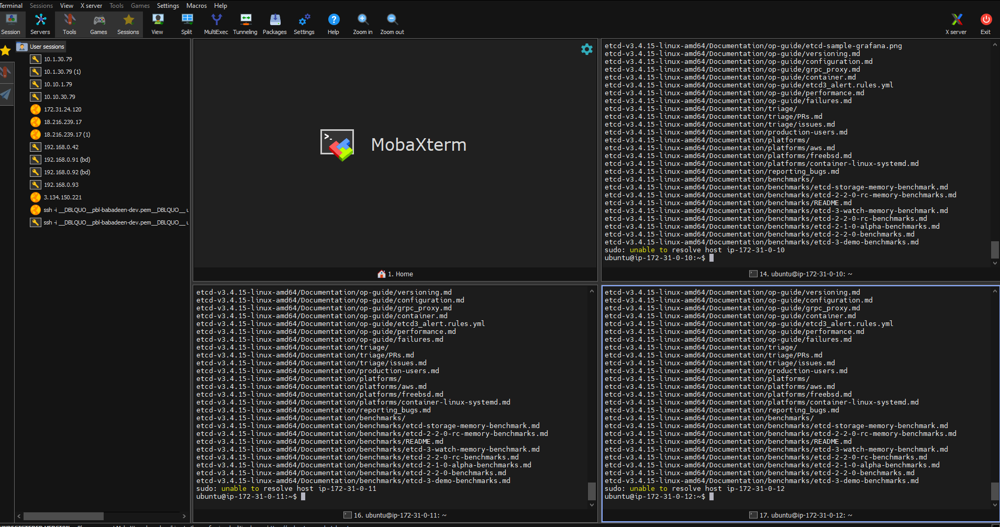

- Configure the etcd server

        {
         sudo mkdir -p /etc/etcd /var/lib/etcd
         sudo chmod 700 /var/lib/etcd
         sudo cp ca.pem master-kubernetes-key.pem master-kubernetes.pem /etc/etcd/
        }

- The instance internal IP address will be used to serve client requests and communicate with etcd cluster peers. Retrieve the internal IP address for the current compute instance

      export INTERNAL_IP=$(curl -s http://169.254.169.254/latest/meta-data/local-ipv4)

- Each `etcd` member must have a unique name within an etcd cluster.

- Set the etcd name to node Private IP address so it will uniquely identify the machine:

      ETCD_NAME=$(curl -s http://169.254.169.254/latest/user-data/ \
        | tr "|" "\n" | grep "^name" | cut -d"=" -f2)

      echo ${ETCD_NAME}

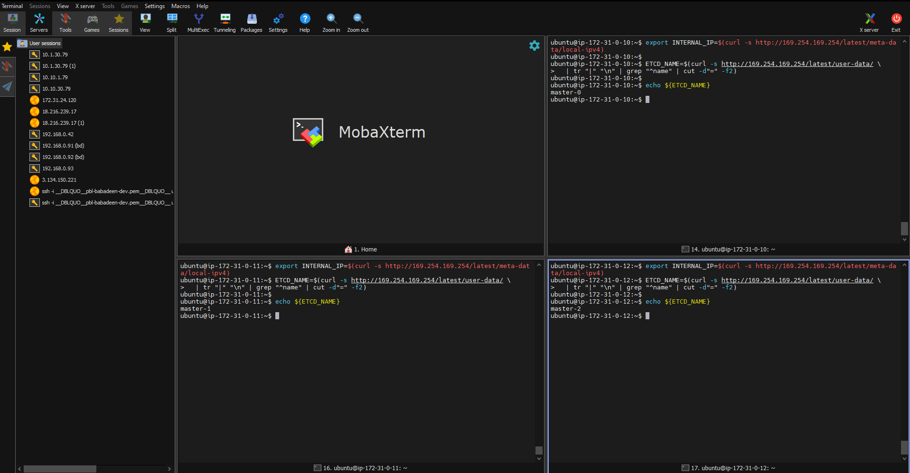

- Create the `etcd.service ` systemd unit file:

      cat <<EOF | sudo tee /etc/systemd/system/etcd.service
      [Unit]
      Description=etcd
      Documentation=https://github.com/coreos

      [Service]
      Type=notify
      ExecStart=/usr/local/bin/etcd \\
        --name ${ETCD_NAME} \\
        --trusted-ca-file=/etc/etcd/ca.pem \\
        --peer-trusted-ca-file=/etc/etcd/ca.pem \\
        --peer-client-cert-auth \\
        --client-cert-auth \\
        --listen-peer-urls https://${INTERNAL_IP}:2380 \\
        --listen-client-urls https://${INTERNAL_IP}:2379,https://127.0.0.1:2379 \\
        --advertise-client-urls https://${INTERNAL_IP}:2379 \\
        --initial-cluster-token etcd-cluster-0 \\
        --initial-cluster master-0=https://172.31.0.10:2380,master-1=https://172.31.0.11:2380,master-2=https://172.31.0.12:2380 \\
        --cert-file=/etc/etcd/master-kubernetes.pem \\
        --key-file=/etc/etcd/master-kubernetes-key.pem \\
        --peer-cert-file=/etc/etcd/master-kubernetes.pem \\
        --peer-key-file=/etc/etcd/master-kubernetes-key.pem \\
        --initial-advertise-peer-urls https://${INTERNAL_IP}:2380 \\
        --initial-cluster-state new \\
        --data-dir=/var/lib/etcd
      Restart=on-failure
      RestartSec=5

      [Install]
      WantedBy=multi-user.target
      EOF
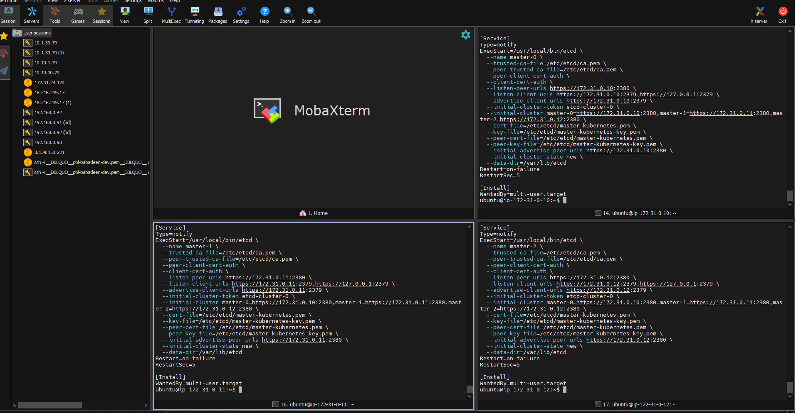

- Start and enable the etcd Server

         {
          sudo systemctl daemon-reload
          sudo systemctl enable etcd
          sudo systemctl start etcd
         
        }

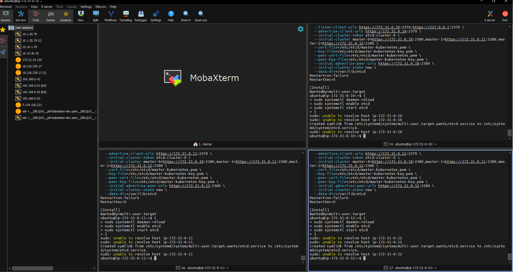

- Verify the `etcd installation`

        sudo ETCDCTL_API=3 etcdctl member list \
        --endpoints=https://127.0.0.1:2379 \
        --cacert=/etc/etcd/ca.pem \
        --cert=/etc/etcd/master-kubernetes.pem \
        --key=/etc/etcd/master-kubernetes-key.pem

### BOOTSTRAP THE CONTROL PLANE --In this section, you will configure the components for the control plane on the master/controller nodes.

-  Create the Kubernetes configuration directory

         sudo mkdir -p /etc/kubernetes/config

-  Download the official Kubernetes release binaries:

        wget -q --show-progress --https-only --timestamping \
        "https://storage.googleapis.com/kubernetes-release/release/v1.21.0/bin/linux/amd64/kube-apiserver" \
        "https://storage.googleapis.com/kubernetes-release/release/v1.21.0/bin/linux/amd64/kube-controller-manager" \
        "https://storage.googleapis.com/kubernetes-release/release/v1.21.0/bin/linux/amd64/kube-scheduler" \
        "https://storage.googleapis.com/kubernetes-release/release/v1.21.0/bin/linux/amd64/kubectl"

-  Install the Kubernetes binaries:

          {
          chmod +x kube-apiserver kube-controller-manager kube-scheduler kubectl
          sudo mv kube-apiserver kube-controller-manager kube-scheduler kubectl /usr/local/bin/
          }
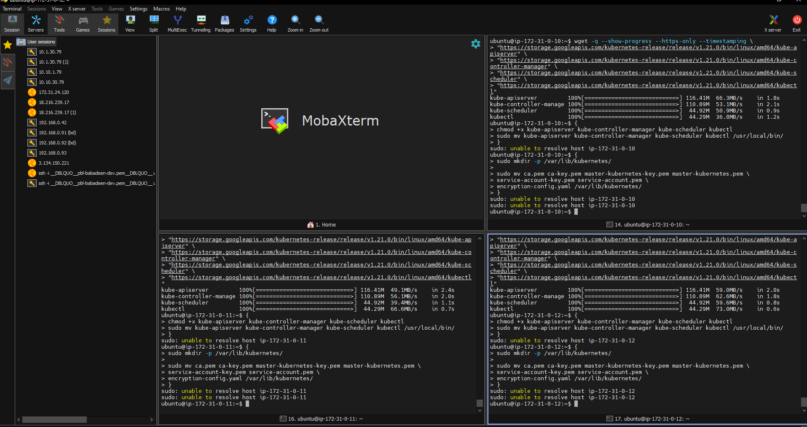

- Configure the Kubernetes API Server:

          {
          sudo mkdir -p /var/lib/kubernetes/

          sudo mv ca.pem ca-key.pem master-kubernetes-key.pem master-kubernetes.pem \
          service-account-key.pem service-account.pem \
          encryption-config.yaml /var/lib/kubernetes/
          }

- The instance internal IP address will be used to advertise the API Server to members of the cluster. Retrieve the internal IP address for the current compute instance:

         export INTERNAL_IP=$(curl -s http://169.254.169.254/latest/meta-data/local-ipv4)

-  Create the `kube-apiserver.service` systemd unit file

        cat <<EOF | sudo tee /etc/systemd/system/kube-apiserver.service
        [Unit]
        Description=Kubernetes API Server
        Documentation=https://github.com/kubernetes/kubernetes

        [Service]
        ExecStart=/usr/local/bin/kube-apiserver \\
          --advertise-address=${INTERNAL_IP} \\
          --allow-privileged=true \\
          --apiserver-count=3 \\
          --audit-log-maxage=30 \\
          --audit-log-maxbackup=3 \\
          --audit-log-maxsize=100 \\
          --audit-log-path=/var/log/audit.log \\
          --authorization-mode=Node,RBAC \\
          --bind-address=0.0.0.0 \\
          --client-ca-file=/var/lib/kubernetes/ca.pem \\
          --enable-admission-plugins=NamespaceLifecycle,NodeRestriction,LimitRanger,ServiceAccount,DefaultStorageClass,ResourceQuota \\
          --etcd-cafile=/var/lib/kubernetes/ca.pem \\
          --etcd-certfile=/var/lib/kubernetes/master-kubernetes.pem \\
          --etcd-keyfile=/var/lib/kubernetes/master-kubernetes-key.pem\\
          --etcd-servers=https://172.31.0.10:2379,https://172.31.0.11:2379,https://172.31.0.12:2379 \\
          --event-ttl=1h \\
          --encryption-provider-config=/var/lib/kubernetes/encryption-config.yaml \\
          --kubelet-certificate-authority=/var/lib/kubernetes/ca.pem \\
          --kubelet-client-certificate=/var/lib/kubernetes/master-kubernetes.pem \\
          --kubelet-client-key=/var/lib/kubernetes/master-kubernetes-key.pem \\
          --runtime-config='api/all=true' \\
          --service-account-key-file=/var/lib/kubernetes/service-account.pem \\
          --service-account-signing-key-file=/var/lib/kubernetes/service-account-key.pem \\
          --service-account-issuer=https://${INTERNAL_IP}:6443 \\
          --service-cluster-ip-range=172.32.0.0/24 \\
          --service-node-port-range=30000-32767 \\
          --tls-cert-file=/var/lib/kubernetes/master-kubernetes.pem \\
          --tls-private-key-file=/var/lib/kubernetes/master-kubernetes-key.pem \\
          --v=2
        Restart=on-failure
        RestartSec=5

        [Install]
        WantedBy=multi-user.target
        EOF

- Configure the Kubernetes Controller Manager:

- Move the kube-controller-manager kubeconfig into place:

         sudo mv kube-controller-manager.kubeconfig /var/lib/kubernetes/

- Export some variables to retrieve the vpc_cidr – This will be required for the bind-address flag:

      export AWS_METADATA="http://169.254.169.254/latest/meta-data"
      export EC2_MAC_ADDRESS=$(curl -s $AWS_METADATA/network/interfaces/macs/ | head -n1 | tr -d '/')
      export VPC_CIDR=$(curl -s $AWS_METADATA/network/interfaces/macs/$EC2_MAC_ADDRESS/vpc-ipv4-cidr-block/)
      export NAME=k8s-cluster-from-ground-up

7. Create the `kube-controller-manager.service` systemd unit file:

        cat <<EOF | sudo tee /etc/systemd/system/kube-controller-manager.service
        [Unit]
        Description=Kubernetes Controller Manager
        Documentation=https://github.com/kubernetes/kubernetes

        [Service]
        ExecStart=/usr/local/bin/kube-controller-manager \\
          --bind-address=0.0.0.0 \\
          --cluster-cidr=${VPC_CIDR} \\
          --cluster-name=${NAME} \\
          --cluster-signing-cert-file=/var/lib/kubernetes/ca.pem \\
          --cluster-signing-key-file=/var/lib/kubernetes/ca-key.pem \\
          --kubeconfig=/var/lib/kubernetes/kube-controller-manager.kubeconfig \\
          --authentication-kubeconfig=/var/lib/kubernetes/kube-controller-manager.kubeconfig \\
          --authorization-kubeconfig=/var/lib/kubernetes/kube-controller-manager.kubeconfig \\
          --leader-elect=true \\
          --root-ca-file=/var/lib/kubernetes/ca.pem \\
          --service-account-private-key-file=/var/lib/kubernetes/service-account-key.pem \\
          --service-cluster-ip-range=172.32.0.0/24 \\
          --use-service-account-credentials=true \\
          --v=2
        Restart=on-failure
        RestartSec=5

        [Install]
        WantedBy=multi-user.target
        EOF

- Configure the Kubernetes Scheduler: Move the kube-scheduler kubeconfig into place:

         sudo mv kube-scheduler.kubeconfig /var/lib/kubernetes/
         sudo mkdir -p /etc/kubernetes/config

-  Create the `kube-scheduler.yaml` configuration file:

        cat <<EOF | sudo tee /etc/kubernetes/config/kube-scheduler.yaml
        apiVersion: kubescheduler.config.k8s.io/v1beta1
        kind: KubeSchedulerConfiguration
        clientConnection:
          kubeconfig: "/var/lib/kubernetes/kube-scheduler.kubeconfig"
        leaderElection:
          leaderElect: true
        EOF

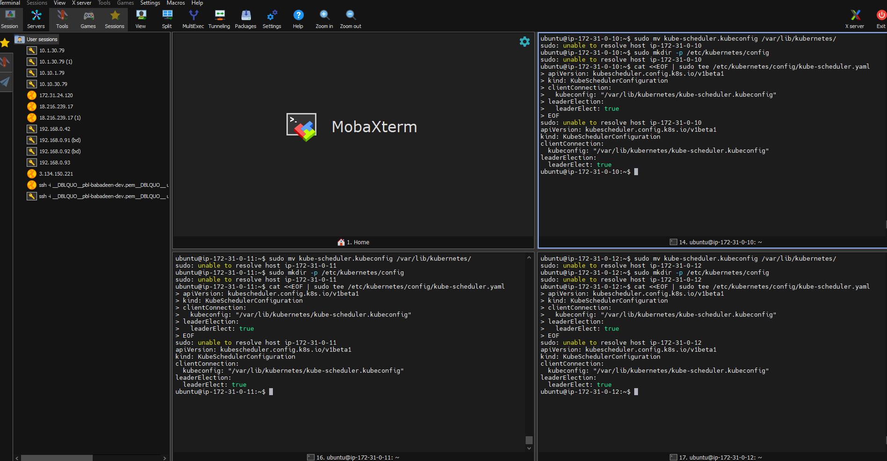
- Create the `kube-scheduler.service systemd` unit file:

      cat <<EOF | sudo tee /etc/systemd/system/kube-scheduler.service
      [Unit]
      Description=Kubernetes Scheduler
      Documentation=https://github.com/kubernetes/kubernetes

      [Service]
      ExecStart=/usr/local/bin/kube-scheduler \\
        --config=/etc/kubernetes/config/kube-scheduler.yaml \\
        --v=2
      Restart=on-failure
      RestartSec=5

      [Install]
      WantedBy=multi-user.target
      EOF

- Start the Controller Services

        {
        sudo systemctl daemon-reload

        sudo systemctl enable kube-apiserver kube-controller-manager kube-scheduler

        sudo systemctl start kube-apiserver kube-controller-manager kube-scheduler
        }

- Check the status of the services. Start with the kube-scheduler and   kube-controller-manager. It may take up to 20 seconds for kube-apiserver to be fully loaded.

         {
          sudo systemctl status kube-apiserver
          sudo systemctl status kube-controller-manager
          sudo systemctl status kube-scheduler
        }

### TEST THAT EVERYTHING IS WORKING FINE

- To get the cluster details run:

       kubectl cluster-info  --kubeconfig admin.kubeconfig

- OUTPUT:

         Kubernetes control plane is running at https://k8s-api-server.svc.darey.io:6443

          To further debug and diagnose cluster problems, use 'kubectl cluster-info dump'.

- To get the current namespaces:

        kubectl get namespaces --kubeconfig admin.kubeconfig

- OUTPUT:

        NAME              STATUS   AGE
        default           Active   22m
        kube-node-lease   Active   22m
        kube-public       Active   22m
        kube-system       Active   22m

- To reach the Kubernetes API Server publicly

        curl --cacert /var/lib/kubernetes/ca.pem https://$INTERNAL_IP:6443/version

- Output

         {
         "major": "1",
         "minor": "21",
         "gitVersion": "v1.21.0",
         "gitCommit": "cb303e613a121a29364f75cc67d3d580833a7479",
         "gitTreeState": "clean",
         "buildDate": "2021-04-08T16:25:06Z",
         "goVersion": "go1.16.1",
         "compiler": "gc",
         "platform": "linux/amd64"
         }

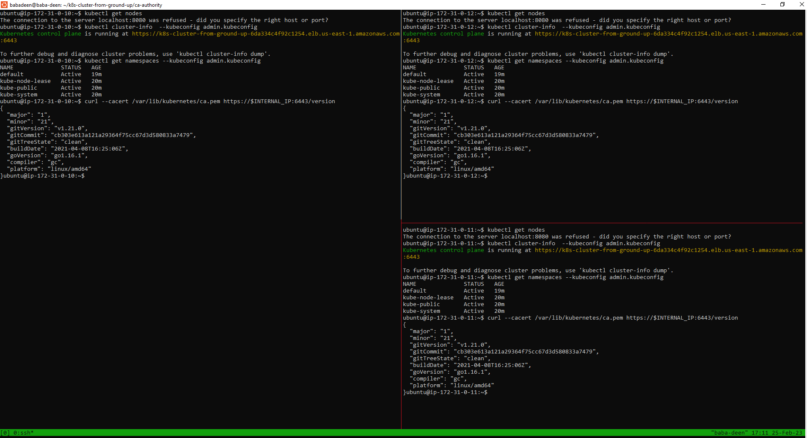

- To get the status of each component:

        kubectl get componentstatuses --kubeconfig admin.kubeconfig

### Configuring Role Based Access Control on of the Master nodes

- On one of the controller nodes, configure Role Based Access Control (RBAC) so that the api-server has necessary authorization for for the kubelet.

-  Create the `ClusterRole:`

        cat <<EOF | kubectl apply --kubeconfig admin.kubeconfig -f -
        apiVersion: rbac.authorization.k8s.io/v1
        kind: ClusterRole
        metadata:
          annotations:
            rbac.authorization.kubernetes.io/autoupdate: "true"
          labels:
            kubernetes.io/bootstrapping: rbac-defaults
          name: system:kube-apiserver-to-kubelet
        rules:
          - apiGroups:
              - ""
            resources:
              - nodes/proxy
              - nodes/stats
              - nodes/log
              - nodes/spec
              - nodes/metrics
            verbs:
              - "*"
        EOF

- Create the `ClusterRoleBinding` to bind the kubernetes user with the role created above:

      cat <<EOF | kubectl --kubeconfig admin.kubeconfig  apply -f -
      apiVersion: rbac.authorization.k8s.io/v1
      kind: ClusterRoleBinding
      metadata:
        name: system:kube-apiserver
        namespace: ""
      roleRef:
        apiGroup: rbac.authorization.k8s.io
        kind: ClusterRole
        name: system:kube-apiserver-to-kubelet
      subjects:
        - apiGroup: rbac.authorization.k8s.io
          kind: User
          name: kubernetes
      EOF

### CONFIGURING THE KUBERNETES WORKER NODES

- We need to `configure Role Based Access (RBAC) for Kubelet` Authorization:

- Configure `RBAC permissions to allow the Kubernetes API Server to access the Kubelet API on each worker node`. Access to the Kubelet API is required for retrieving metrics, logs, and executing commands in pods.

- Create the `system:kube-apiserver-to-kubelet ClusterRole` with permissions to access the Kubelet API and perform most common tasks associated with managing pods on the worker nodes:

- Run the below script on the `Controller node:`

      cat <<EOF | kubectl apply --kubeconfig admin.kubeconfig -f -
      apiVersion: rbac.authorization.k8s.io/v1
      kind: ClusterRole
      metadata:
        annotations:
          rbac.authorization.kubernetes.io/autoupdate: "true"
        labels:
          kubernetes.io/bootstrapping: rbac-defaults
        name: system:kube-apiserver-to-kubelet
      rules:
        - apiGroups:
            - ""
          resources:
            - nodes/proxy
            - nodes/stats
            - nodes/log
            - nodes/spec
            - nodes/metrics
          verbs:
            - "*"
      EOF

- Bind the `system:kube-apiserver-to-kubelet ClusterRole` to the kubernetes user so that API server can authenticate successfully to the kubelets on the `worker nodes:`

      cat <<EOF | kubectl apply --kubeconfig admin.kubeconfig -f -
      apiVersion: rbac.authorization.k8s.io/v1
      kind: ClusterRoleBinding
      metadata:
        name: system:kube-apiserver
        namespace: ""
      roleRef:
        apiGroup: rbac.authorization.k8s.io
        kind: ClusterRole
        name: system:kube-apiserver-to-kubelet
      subjects:
        - apiGroup: rbac.authorization.k8s.io
          kind: User
          name: kubernetes
      EOF

### Bootstraping components on the worker nodes

- The following components will be installed on each node:

1. kubelet
2. kube-proxy
3. Containerd or Docker
4. Networking plugins

- SSH into the worker nodes

1. worker-0
2. worker-1
3. worker-2

- Worker-1

      worker_1_ip=$(aws ec2 describe-instances \
      --filters "Name=tag:Name,Values=${NAME}-worker-0" \
      --output text --query 'Reservations[].Instances[].PublicIpAddress')
      ssh -i k8s-cluster-from-ground-up.id_rsa ubuntu@${worker_1_ip}

- Worker-2

      worker_2_ip=$(aws ec2 describe-instances \
      --filters "Name=tag:Name,Values=${NAME}-worker-1" \
      --output text --query 'Reservations[].Instances[].PublicIpAddress')
      ssh -i k8s-cluster-from-ground-up.id_rsa ubuntu@${worker_2_ip}

- Worker-3

      worker_3_ip=$(aws ec2 describe-instances \
      --filters "Name=tag:Name,Values=${NAME}-worker-2" \
      --output text --query 'Reservations[].Instances[].PublicIpAddress')
      ssh -i k8s-cluster-from-ground-up.id_rsa ubuntu@${worker_3_ip}

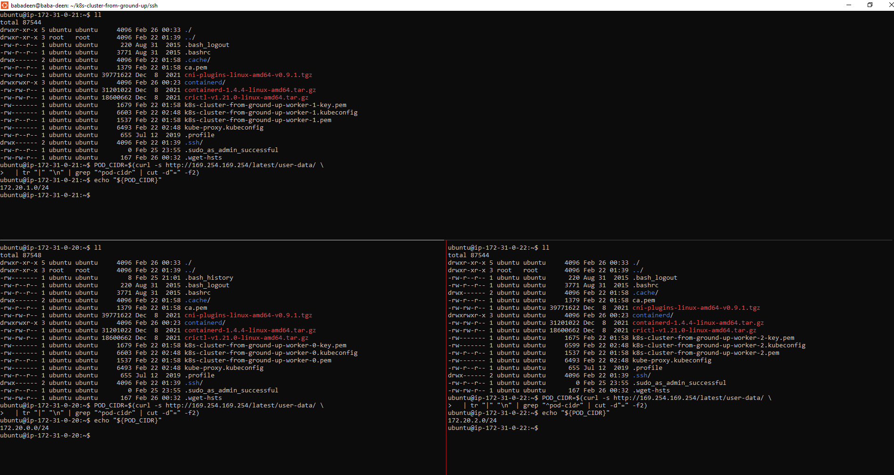

- Install OS dependencies:

         {
         sudo apt-get update
         sudo apt-get -y install socat conntrack ipset
         }

### OVERVIEW OF KUBERNETES NETWORK POLICY AND HOW IT IS IMPLEMENTED

      apiVersion: extensions/v1beta1
      kind: NetworkPolicy
      metadata:
        name: database-network-policy
        namespace: tooling-db
      spec:
        podSelector:
          matchLabels:
            app: mysql
        ingress:
        - from:
          - namespaceSelector:
            matchLabels:
              app: tooling
          - podSelector:
            matchLabels:
            role: frontend
        ports:
          - protocol: tcp
          port: 3306

- NOTE: Best practice is to use solutions like RDS for database implementation. So the above is just to help you understand the concept

### If swap s not disabled, kubelet will not start. It is highly recommended to allow Kubernetes to handle resource allocation.

- Disable Swap

- Test if swap is already enabled on the host:

         sudo swapon --show

- If there is no output, then you are good to go. Otherwise, run below command to turn it off

         sudo swapoff -a

## Download and install a container runtime. -- Containerd

- Containerd -- Download binaries for `runc, cri-ctl, and containerd`

          wget https://github.com/opencontainers/runc/releases/download/v1.0.0-rc93/runc.amd64 \
          https://github.com/kubernetes-sigs/cri-tools/releases/download/v1.21.0/crictl-v1.21.0-linux-amd64.tar.gz \
         https://github.com/containerd/containerd/releases/download/v1.4.4/containerd-1.4.4-linux-amd64.tar.gz 

- Configure containerd:

      {
        mkdir containerd
        tar -xvf crictl-v1.21.0-linux-amd64.tar.gz
        tar -xvf containerd-1.4.4-linux-amd64.tar.gz -C containerd
        sudo mv runc.amd64 runc
        chmod +x  crictl runc  
        sudo mv crictl runc /usr/local/bin/
        sudo mv containerd/bin/* /bin/
      }
- create a dir for the containerd  and run the below command and script

      sudo mkdir -p /etc/containerd/

      cat << EOF | sudo tee /etc/containerd/config.toml
      [plugins]
        [plugins.cri.containerd]
          snapshotter = "overlayfs"
          [plugins.cri.containerd.default_runtime]
            runtime_type = "io.containerd.runtime.v1.linux"
            runtime_engine = "/usr/local/bin/runc"
            runtime_root = ""
      EOF

- Create the `containerd.service systemd` unit file:

      cat <<EOF | sudo tee /etc/systemd/system/containerd.service
      [Unit]
      Description=containerd container runtime
      Documentation=https://containerd.io
      After=network.target

      [Service]
      ExecStartPre=/sbin/modprobe overlay
      ExecStart=/bin/containerd
      Restart=always
      RestartSec=5
      Delegate=yes
      KillMode=process
      OOMScoreAdjust=-999
      LimitNOFILE=1048576
      LimitNPROC=infinity
      LimitCORE=infinity

      [Install]
      WantedBy=multi-user.target
      EOF

- Create directories  to configure kubelet, kube-proxy, cni, and a directory to keep the kubernetes root `ca file:`

      sudo mkdir -p \
        /var/lib/kubelet \
        /var/lib/kube-proxy \
        /etc/cni/net.d \
        /opt/cni/bin \
        /var/lib/kubernetes \
        /var/run/kubernetes

### Download and Install CNI

- CNI (Container Network Interface), a Cloud Native Computing Foundation project, consists of a specification and libraries for writing plugins to configure network interfaces in Linux containers. It also comes with a number of plugins.

Kubernetes uses CNI as an interface between network providers and Kubernetes Pod networking. Network providers create network plugin that can be used to implement the Kubernetes networking, and includes additional set of rich features that Kubernetes does not provide out of the box.

- Download CNI

      wget -q --show-progress --https-only --timestamping \
        https://github.com/containernetworking/plugins/releases/download/v0.9.1/cni-plugins-linux-amd64-v0.9.1.tgz

- Install CNI into /opt/cni/bin/

      sudo tar -xvf cni-plugins-linux-amd64-v0.9.1.tgz -C /opt/cni/bin/

- The output shows the plugins that comes with the CNI

      ./
      ./macvlan
      ./flannel
      ./static
      ./vlan
      ./portmap
      ./host-local
      ./vrf
      ./bridge
      ./tuning
      ./firewall
      ./host-device
      ./sbr
      ./loopback
      ./dhcp
      ./ptp
      ./ipvlan
      ./bandwidth

- Download binaries for kubectl, kube-proxy, and kubelet

      wget -q --show-progress --https-only --timestamping \
        https://storage.googleapis.com/kubernetes-release/release/v1.21.0/bin/linux/amd64/kubectl \
        https://storage.googleapis.com/kubernetes-release/release/v1.21.0/bin/linux/amd64/kube-proxy \
        https://storage.googleapis.com/kubernetes-release/release/v1.21.0/bin/linux/amd64/kubelet

- Install the downloaded binaries

      {
        chmod +x  kubectl kube-proxy kubelet  
        sudo mv  kubectl kube-proxy kubelet /usr/local/bin/
      }

### Configuring the network for THE WORKER NODES COMPONENTS

### Get the POD_CIDR that will be used as part of network configuration

      POD_CIDR=$(curl -s http://169.254.169.254/latest/user-data/ \
     | tr "|" "\n" | grep "^pod-cidr" | cut -d"=" -f2)
      echo "${POD_CIDR}"

### Pod Network -- configure the bridge and loopback networks

### Configure the Bridge network :

     cat > 172-20-bridge.conf <<EOF
     {
    "cniVersion": "0.3.1",
    "name": "bridge",
    "type": "bridge",
    "bridge": "cnio0",
    "isGateway": true,
    "ipMasq": true,
    "ipam": {
        "type": "host-local",
        "ranges": [
          [{"subnet": "${POD_CIDR}"}]
        ],
        "routes": [{"dst": "0.0.0.0/0"}]
     }
     }
    EOF

### Configure the Loopback network :

    cat > 99-loopback.conf <<EOF
    {
    "cniVersion": "0.3.1",
    "type": "loopback"
    }
    EOF

###  Move the files to the network configuration directory:

    sudo mv 172-20-bridge.conf 99-loopback.conf /etc/cni/net.d/

###  Store the worker’s name in a variable:

      NAME=k8s-cluster-from-ground-up
      WORKER_NAME=${NAME}-$(curl -s http://169.254.169.254/latest/user-data/ \
      | tr "|" "\n" | grep "^name" | cut -d"=" -f2)
      echo "${WORKER_NAME}"

###  Move the certificates and kubeconfig file to their respective configuration directories:

      sudo mv ${WORKER_NAME}-key.pem ${WORKER_NAME}.pem /var/lib/kubelet/
      sudo mv ${WORKER_NAME}.kubeconfig /var/lib/kubelet/kubeconfig
      sudo mv kube-proxy.kubeconfig /var/lib/kube-proxy/kubeconfig
      sudo mv ca.pem /var/lib/kubernetes/

### Create the kubelet-config.yaml file Ensure the needed variables exist

        NAME=k8s-cluster-from-ground-up
        WORKER_NAME=${NAME}-$(curl -s http://169.254.169.254/latest/user-data/ \
        | tr "|" "\n" | grep "^name" | cut -d"=" -f2)
        echo "${WORKER_NAME}"

      cat <<EOF | sudo tee /var/lib/kubelet/kubelet-config.yaml
      kind: KubeletConfiguration
      apiVersion: kubelet.config.k8s.io/v1beta1
      authentication:
      anonymous:
      enabled: false
      webhook:
      enabled: true
      x509:
      clientCAFile: "/var/lib/kubernetes/ca.pem"
      authorization:
      mode: Webhook
      clusterDomain: "cluster.local"
      clusterDNS:
      - "10.32.0.10"
      resolvConf: "/etc/resolv.conf"
      runtimeRequestTimeout: "15m"
      tlsCertFile: "/var/lib/kubelet/${WORKER_NAME}.pem"
      tlsPrivateKeyFile: "/var/lib/kubelet/${WORKER_NAME}-key.pem"
      EOF

### Configure the kubelet systemd service

        cat <<EOF | sudo tee /etc/systemd/system/kubelet.service
        [Unit]
        Description=Kubernetes Kubelet
        Documentation=https://github.com/kubernetes/kubernetes
        After=containerd.service
        Requires=containerd.service
        [Service]
        ExecStart=/usr/local/bin/kubelet \\
      --config=/var/lib/kubelet/kubelet-config.yaml \\
      --cluster-domain=cluster.local \\
      --container-runtime=remote \\
      --container-runtime-endpoint=unix:///var/run/containerd/containerd.sock \\
      --image-pull-progress-deadline=2m \\
      --kubeconfig=/var/lib/kubelet/kubeconfig \\
      --network-plugin=cni \\
      --register-node=true \\
      --v=2
      Restart=on-failure
      RestartSec=5
      [Install]
      WantedBy=multi-user.target
      EOF

### Create the kube-proxy.yaml file

    cat <<EOF | sudo tee /var/lib/kube-proxy/kube-proxy-config.yaml
    kind: KubeProxyConfiguration
    apiVersion: kubeproxy.config.k8s.io/v1alpha1
    clientConnection:
      kubeconfig: "/var/lib/kube-proxy/kubeconfig"
    mode: "iptables"
    clusterCIDR: "172.31.0.0/16"
    EOF

### Configure the Kube Proxy systemd service

    cat <<EOF | sudo tee /etc/systemd/system/kube-proxy.service
    [Unit]
    Description=Kubernetes Kube Proxy
    Documentation=https://github.com/kubernetes/kubernetes
    [Service]
    ExecStart=/usr/local/bin/kube-proxy \\
      --config=/var/lib/kube-proxy/kube-proxy-config.yaml
    Restart=on-failure
    RestartSec=5
    [Install]
    WantedBy=multi-user.target
    EOF

### Reload configurations and start both services

    {
      sudo systemctl daemon-reload
      sudo systemctl enable containerd kubelet kube-proxy
      sudo systemctl start containerd kubelet kube-proxy
    }

